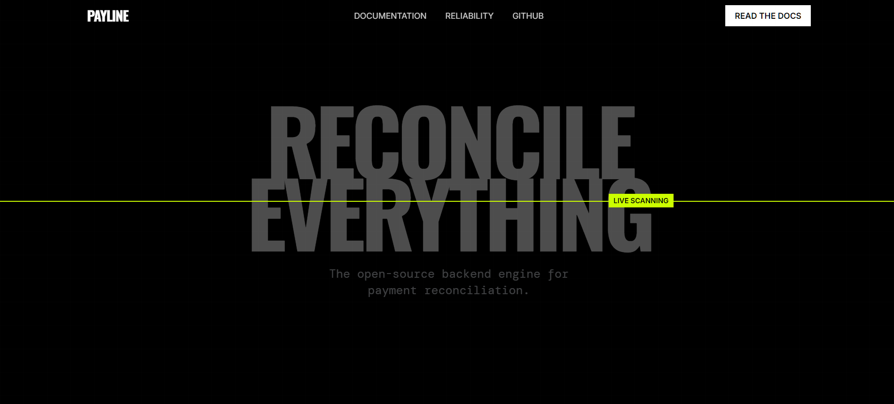
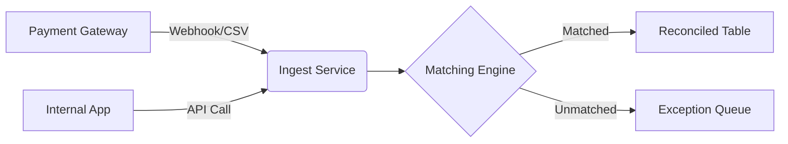

# Payline

> **The Reconciliation Engine** — A high-performance node.js system for untangling financial data.



## Overview

Payline is an opinionated, production-grade reconciliation backend designed to be the single source of truth for your financial operations. It acts as the middleware between your internal ledger (orders, subscriptions) and external financial institutions (Stripe, Adyen, Bank Feeds).

It solves the "N+1" problem of payments: **One internal transaction may equal N bank events (settlement, refund, chargeback, fee).**

## Core Features

-   **Multi-Source Ingestion:** Universal adapter pattern for ingesting CSVs (MT940, CAMT.053) and API Webhooks.
-   **Heuristic Matching Engine:**
    -   **Strong Match:** Strict mapping by `payment_reference` or `idempotency_key`.
    -   **Fuzzy Match:** Heuristic clustering based on `amount` + `date_window` + `currency`.
-   **Idempotent Ledger:** Double-entry accounting principles enforced at the database level.
-   **Scalable Architecture:** Built on Fastify and Knex Streams to handle high-volume datasets with minimal memory footprint.

## Architecture

The system is built as a monolithic modular backend.

-   **Runtime:** Node.js (TypeScript)
-   **Framework:** Fastify (Lightweight, Low Overhead)
-   **Database:** PostgreSQL (ACID Compliance is mandatory)
-   **ORM/Query Builder:** Knex.js (SQL-first approach)
-   **Validation:** Zod (Runtime type safety)

### Data Flow



## API Quick Reference

### 1. Record Internal Payment
`POST /payments`
```json
{
  "order_id": "ORD-1001",
  "amount": 500.00,
  "gateway_reference": "ch_3N5..."
}
```

### 2. Ingest Bank Statement
`POST /statements/import`
Upload raw CSVs from your banking partners. The system automatically normalizes them.

### 3. Run Reconciliation
`POST /reconcile/run`
Triggers the matching algorithm. Returns a summary of matched vs. unmatched items.

## Getting Started

```bash
# 1. Install dependencies
npm install

# 2. Run Migrations
npm run migrate:latest

# 3. Start the Engine
npm run dev
```

---

_The `payline-site` directory contains a React-based visualizer for this engine.
