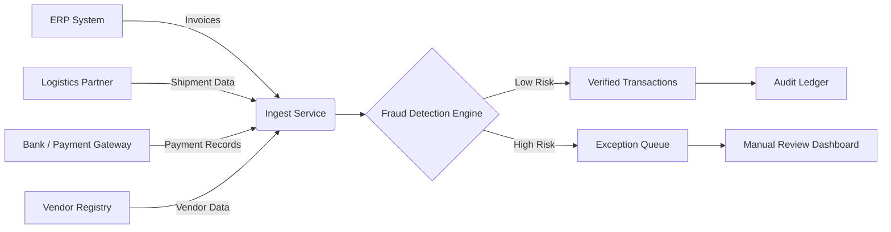

# Payline  

> **Multi-Tier Supply Chain Fraud Detection & Management Engine** — A high-performance Node.js system for detecting, tracing, and mitigating fraud across complex supplier networks.

---

## Overview  

Payline (Hackathon Edition) is a production-grade backend reimagined as a **real-time fraud intelligence engine** for multi-tier supply chains.  

Modern supply chains involve multiple layers — manufacturers, distributors, logistics partners, retailers, and financial intermediaries. Fraud can occur at any layer in the form of:

- Duplicate invoicing  
- Phantom shipments  
- Inflated procurement costs  
- Counterfeit goods  
- Unauthorized vendor onboarding  
- Payment diversion  

This system acts as the **central risk orchestration layer**, integrating operational, financial, and logistics data to detect anomalies and enforce compliance across tiers.

---

## Problem Statement  

Supply chain fraud is complex because:

- One shipment may involve multiple invoices, payments, and carriers.  
- Tier-2 and Tier-3 vendors often lack transparency.  
- Data sources are fragmented across ERPs, logistics APIs, banking feeds, and procurement systems.  
- Fraud patterns evolve and bypass rule-based detection.  

Payline addresses the **N+1 problem of supply chains**:  

> One legitimate procurement event may produce N transactional artifacts across multiple systems — and fraud can hide in the gaps between them.

---

## Core Features  

### Multi-Source Data Ingestion  

Universal adapter architecture for ingesting:

- ERP exports (CSV / XML)  
- Logistics manifests  
- Vendor master records  
- Bank statements  
- Procurement APIs  
- Webhooks from partner systems  

### Cross-Tier Entity Linking  

- Vendor → Sub-vendor → Shipment → Invoice → Payment graph mapping  
- Builds a unified risk profile across tiers  

### Heuristic & Rule-Based Fraud Detection  

**Strong Match Detection**

- Exact invoice ID duplication  
- Duplicate payment reference  
- Reused shipment tracking numbers  
- Repeated vendor bank accounts  

**Fuzzy Anomaly Detection**

- Amount mismatch across invoice vs payment  
- Suspicious date-window clustering  
- Vendor behavior deviation  
- Abnormal pricing variance  
- Tier-level risk propagation  

### Risk Scoring Engine  

Each entity (vendor, invoice, shipment, payment) receives:

- Dynamic fraud score  
- Tier-level risk aggregation  
- Escalation flag  

### Exception Management Queue  

- Flagged transactions moved to review queue  
- Manual override support  
- Audit trail maintained  

### Idempotent Ledger & Audit Trail  

- Immutable transaction logs  
- Double-entry validation for financial flows  
- Full traceability across supply tiers  

---

## Architecture  

Designed as a **monolithic modular backend optimized for high-throughput fraud analytics.**

- **Runtime:** Node.js (TypeScript)  
- **Framework:** Fastify  
- **Database:** PostgreSQL  
- **ORM/Query Builder:** Knex.js  
- **Validation:** Zod  

---

## System Modules  

1. **Ingest Service**  
   Normalizes heterogeneous supply chain data into a unified schema.  

2. **Graph Builder**  
   Constructs cross-tier relationships (vendor ↔ invoice ↔ shipment ↔ payment).  

3. **Fraud Detection Engine**  
   - Rule engine  
   - Heuristic matcher  
   - Risk scoring model  

4. **Exception & Review Service**  
   Manages flagged anomalies and review lifecycle.  

5. **Audit & Reporting Layer**  
   Generates risk dashboards and compliance reports.  

---

## Data Flow  


```mermaid
graph LR
    A[ERP System] -->|Invoices| B(Ingest Service)
    C[Logistics Partner] -->|Shipment Data| B
    D[Bank / Payment Gateway] -->|Payment Records| B
    E[Vendor Registry] -->|Vendor Data| B
    
    B --> F{Fraud Detection Engine}
    F -->|Low Risk| G[Verified Transactions]
    F -->|High Risk| H[Exception Queue]
    
    G --> I[Audit Ledger]
    H --> J[Manual Review Dashboard]
```

---

## API Quick Reference  

### 1. Register Vendor  

`POST /vendors`

```json
{
  "vendor_id": "V-1023",
  "tier": 2,
  "bank_account": "XXXX1234",
  "country": "IN"
}
```

### 2. Record Invoice  

`POST /invoices`

```json
{
  "invoice_id": "INV-9001",
  "vendor_id": "V-1023",
  "amount": 120000,
  "currency": "INR",
  "shipment_id": "SHP-5501"
}
```

### 3. Import Shipment Data  

`POST /shipments/import`  

Upload logistics manifest files or partner exports.

### 4. Run Fraud Scan  

`POST /fraud/run`

Returns:

```json
{
  "total_entities_scanned": 5400,
  "high_risk": 43,
  "medium_risk": 112,
  "low_risk": 5245
}
```

---

## Hackathon Value Proposition  

- Detects fraud across multiple supply chain tiers  
- Graph-based linking for anomaly detection  
- High performance and scalable backend  
- Production-ready architecture  
- Built for real-world datasets